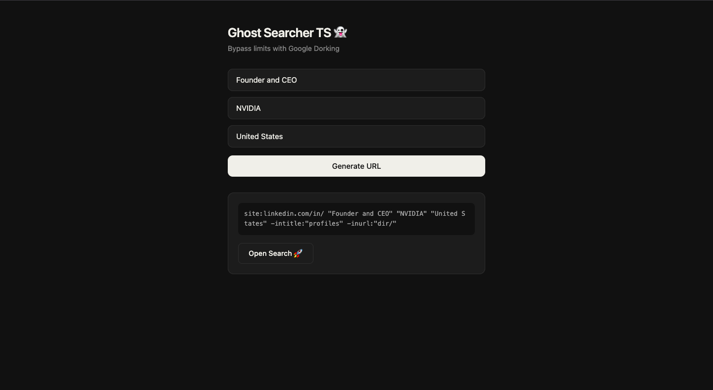

# LinkedIn Ghost Searcher 👻

> Bypass LinkedIn's search limits using Google Dorking — find profiles anonymously, without triggering "LinkedIn Jail".

---

## What is this?

LinkedIn restricts how many profiles free-tier users can view. Ghost Searcher works around this by generating advanced Google Dork queries that surface LinkedIn profiles directly through Google — meaning no profile view notifications, no paywalls, no restrictions.

---

## Main page


## Features

- **Dynamic query generation** — builds complex Google Dorking strings from Job Title, Company, and Location
- **Anti-noise filtering** — operators like `-intitle:"profiles"` and `-inurl:"dir/"` strip directory pages and junk results
- **Outreach templates** — built-in message templates for cold networking and coffee chats
- **Type-safe end-to-end** — TypeScript interfaces on the frontend, Pydantic models on the backend
- **Responsive UI** — dark-themed SCSS interface

---

## Tech Stack

| Layer | Tech |
|---|---|
| Frontend | React 18, TypeScript, SCSS |
| Backend | FastAPI, Python 3.11+, Uvicorn |
| Communication | REST API with CORS middleware |

---

## Quick Start

**Backend**
```bash
pip install fastapi uvicorn
uvicorn main:app --reload
```

**Frontend**
```bash
npm install
npm start
```

The frontend runs on `http://localhost:3000`, backend on `http://localhost:8000`.

---

## How it works

1. User enters a Job Title, Company, and optional Location
2. The FastAPI backend constructs a Google Dork string, e.g.:
   ```
   site:linkedin.com/in "Software Engineer" "Google" "Berlin" -intitle:"profiles" -inurl:"dir/"
   ```
3. The frontend receives the raw query + a ready-to-open Google URL
4. User clicks through to anonymous search results

---

## Project Structure

```
├── backend/
│   └── main.py          
└── frontend/
    ├── src/
    │   ├── App.tsx       
    │   └── App.scss      
    └── package.json
```

---

## For Developers

- **State management** — React Hooks (`useState`, `useEffect`)
- **Async communication** — clean `async/await` fetch calls
- **Validation** — TypeScript interfaces + Pydantic schemas enforce strict types across the stack
- **Architecture** — query generation logic is fully decoupled from the UI layer

---

## Disclaimer

This tool is intended for educational purposes and legitimate OSINT research only. Always respect LinkedIn's Terms of Service and applicable privacy laws in your jurisdiction.

---

<p align="center">Made with 👻 and Google Dorking</p>